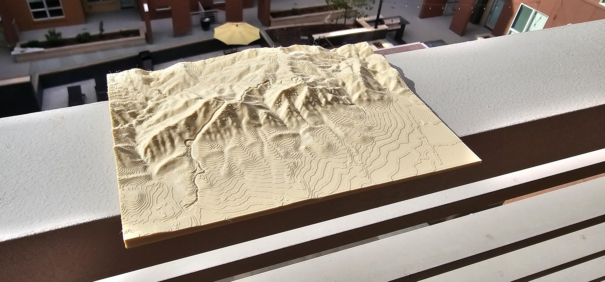

# GpxTracks3d

Carve a GPS track into a 3D-printable terrain model.

Give it a GPX file from a hike, run, or ride, plus an STL terrain tile covering the same area, and it cuts the route into the surface of the terrain as a smooth groove. The result is a new STL you can print — a physical map of the mountain with your track engraved along it.



It georeferences the track for you. You never move the track by hand in CAD: the code works out where the model sits on the Earth from two corner coordinates you supply, converts every GPS point into the model's coordinate system, and drapes the track onto the terrain surface.

## Requirements

- [uv](https://docs.astral.sh/uv/) (handles Python and all dependencies)
- An internet connection — the ground elevation of your model's corner is looked up from the [OpenTopoData](https://www.opentopodata.org/) API on every run
- A desktop session — the tool opens interactive 3D windows and waits for you

## Install

```bash
git clone <this repo>
cd GpxTracks3d
uv sync
```

## Inputs

You need three things in a folder under `data/`:

1. **An STL terrain tile**, generated with [TouchTerrain](https://touchterrain.geol.iastate.edu/) — see below.
2. **A GPX track** covering ground inside that tile.
3. **A `config.json`** describing how the two line up.

## Generating the terrain with TouchTerrain

[TouchTerrain](https://touchterrain.geol.iastate.edu/) is a free tool from Iowa State that turns any region of the Earth into a printable STL. Every model in `data/` came from it.

Open the site, click the map to pick a starting area, then drag the red selection box around the terrain you want. Your whole GPX track must fit inside the box, with a little margin — anything outside gets clipped off the model and the groove will run off the edge.

The settings that matter:

| Setting | Use | Why |
| --- | --- | --- |
| **DEM source** | `USGS/3DEP/10m` in the US | 10 m elevation data, the highest resolution generally available. Outside the US, use one of the SRTM sources. |
| **Tile width** | your printed model's width, in mm | Sets the physical size of the print. The projects here use 30–160 mm. |
| **Number of tiles** | **1 × 1** | See the warning below. |
| **Print resolution** | `0.4` mm | TouchTerrain adjusts this slightly to make the dimensions come out even. |
| **Base thickness** | `2` mm | Solid slab under the terrain. |
| **Z-scale** | `1.0` | Leave at 1. Vertical exaggeration would make the track sit wrong, since the code snaps it to the true surface. |
| **File format** | `STLb` | Binary STL. Far smaller than ASCII. |

> **Use a single 1 × 1 tile.** If you ask TouchTerrain to split the region across multiple tiles, each STL covers only a fraction of the area, but the coordinates in the logfile still describe the *whole* region. The code assumes the STL and the coordinates cover the same ground, so a multi-tile export silently misplaces and mis-scales the track.

Download the zip and unpack it into a folder under `data/`. It contains:

```
logfile.txt                        <- the settings and coordinates you used
10m_-105.65_40.01_tile_1_1.STL     <- the terrain model; this is your in_stl_path
10m_-105.65_40.01.tif              <- the raw elevation raster (unused)
10m_..._DEMandHistogram.png        <- a preview image (unused)
```

## Writing the config from the logfile

Everything you need is in `logfile.txt`. Its first lines record the exact box you dragged:

```
DEM_name = USGS/3DEP/10m
trlat = 40.03538452772285      <- top right latitude
trlon = -105.6259717590332     <- top right longitude
bllat = 39.99094728785393      <- bottom left latitude
bllon = -105.67412277526856    <- bottom left longitude
```

Copy those four numbers straight across, **longitude first**, with a trailing `0`:

```json
"box_upper_right": [ trlon, trlat, 0 ],
"box_lower_left":  [ bllon, bllat, 0 ]
```

which for the log above gives:

```json
"box_upper_right": [-105.6259717590332, 40.03538452772285, 0],
"box_lower_left":  [-105.67412277526856, 39.99094728785393, 0]
```

The swapped order is the single easiest mistake to make here. TouchTerrain writes latitude first; this config wants longitude first.

Point `in_stl_path` at the `*_tile_1_1.STL` from the same zip, and you're done.

### The logfile's map scale

Further down, the logfile prints a line like:

```
map scale is 1 : 140687.88758813293
```

Divide by 1000 to get metres of real terrain per millimetre of model — `140.69` here. When you run the pipeline it prints its own estimate:

```
Model-mm-to-Meters scale factor: 137.399...
```

**These two will not agree due to an as-yet unfixed issue**, typically by 0.5–2.5%, and the model's is always the smaller. That is expected. TouchTerrain rounds the region outward to whole elevation cells, so the STL covers slightly more ground than the box you dragged — but the code only knows about the box. It therefore thinks the terrain is smaller than it is and draws the track slightly too large.

This is what the **Scale** slider is for. If the logfile says `140.69` and the script says `137.40`, the track is `140.69 / 137.40 = 1.024` — about 2.4% too big — so nudge Scale to roughly `0.976`. The bigger the mismatch between the two numbers, the more correction you need.

TODO: Fix this and remove the scale slider. Claude found this while writing this README, thanks Claude.

## The config file

The `config.json` looks like this:

```json
{
  "in_stl_path":  "data/south_arapaho/10m_-105.65_40.01_tile_1_1.STL",
  "out_stl_path": "data/south_arapaho/south_arapaho_autocut.STL",
  "gpx_path":     "data/south_arapaho/South_Arapaho.gpx",
  "box_upper_right": [-105.6259717590332, 40.03538452772285, 0],
  "box_lower_left":  [-105.67412277526856, 39.99094728785393, 0],
  "hike_type": "OUT_AND_BACK"
}
```

| Field | Meaning |
| --- | --- |
| `in_stl_path` | The terrain tile to cut into. |
| `out_stl_path` | Where the finished, cut STL is written. |
| `gpx_path` | One GPX path, or a list of them — every track gets cut into the same model. |
| `box_upper_right` / `box_lower_left` | The real-world corners of the terrain tile, as `[longitude, latitude, 0]`. |
| `hike_type` | `OUT_AND_BACK`, `LOOP`, or `NONE`. |

The corners are **longitude first, then latitude** — the reverse of how TouchTerrain's logfile lists them. They are the *only* thing telling the code where the model sits on Earth, so if they're wrong, or copied from a different tile, the track lands in the wrong place. The third number is altitude; it is ignored, so leave it at `0`.

`hike_type` cleans up the track before cutting. `OUT_AND_BACK` discards everything after the high point, so the return leg doesn't re-cut the same groove. `LOOP` closes the loop by joining the last point to the first. `NONE` leaves the track alone — use it for point-to-point routes.

Only those first two values do anything; any other string falls through unchanged. Several configs in `data/` say `POINT_TO_POINT`, which behaves exactly like `NONE`.

## Run

Open `main.py` and point [line 77](main.py#L77) at your config:

```python
json_inputs = load_from_json(os.path.join("data", "your_project", "config.json"))
```

Then:

```bash
uv run main.py
```

There are no command-line arguments; editing that line is how you switch projects.

## What happens when you run it

For each GPX track, two 3D windows open in turn. **The program pauses at each one until you close it.** This is deliberate, not a freeze.

**Window 1 — alignment.** Your track appears in red over the grey terrain, with *Shift X*, *Shift Y*, *Shift Z*, and *Scale* sliders. The automatic georeferencing is close but not exact, so this is your chance to nudge the track until it follows the ridgelines and valleys it should. Start with *Scale* — the figure to dial in is given by [the logfile's map scale](#the-logfiles-map-scale) — then shift it into place. Close the window to accept what you see.

**Window 2 — confirmation.** The track after cleanup and after being snapped down onto the terrain surface. Nothing to adjust; close it to continue.

The terminal then prints progress through the two slow stages, each a percentage counter:

- *Refining mesh near the GPX track* — subdividing the triangles the groove will pass through, so there's enough resolution to cut into.
- *Cutting out the track* — lowering those triangles to form the groove.

These take a few minutes on a large tile. When it finishes you'll see `Saved new STL file: ...` and your cut model is at `out_stl_path`, ready to slice and print.

Your slider adjustments are not saved anywhere. If you run the same project again, you'll need to redo them.

## Tuning the groove

Also in `main.py`, just below the config line:

```python
cut_radius_mm = 0.9                    # groove radius, in millimetres of printed model
dist_to_refine = 1.2 * cut_radius_mm   # how far from the track to add mesh detail
```

`cut_radius_mm` is the half-width and depth of the channel. Raise it for a bolder, more visible track; lower it for a finer line, but not below what your printer's nozzle can resolve. `dist_to_refine` should stay comfortably above `cut_radius_mm` — triangles outside it are never touched, so a groove wider than the refined band will come out with ragged edges.

The groove's cross-section is a rounded profile that flattens out where it meets the surrounding terrain, which prints more cleanly than a hard-edged semicircle.

## Repairing a broken mesh

If a cut STL has holes or non-manifold edges that upset your slicer, `fix_mesh.py` runs it through [pymeshfix](https://pymeshfix.pyvista.org/). Edit the two hardcoded paths at the top of the file, then:

```bash
uv run fix_mesh.py
```

## Before this existed

The cut used to be done by hand in Fusion 360 — importing the mesh and a snapped track, sweeping a surface along the path, capping and filling it, then combining meshes. The steps are preserved in a comment at the top of `main.py`. `auto_cut.py` now does all of it.
